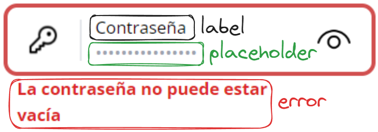

# Manual del Programador *ULink* - Frontend - v0.1.0

> **Disclaimer**
> Este manual del programador no está escrito en piedra y puede cambiar en cualquier momento, cambiando ciertos conceptos de sección o incluso rehaciendo secciones enteras (esto por la naturaleza cambiante de las tecnologías en el desarrollo web y por el incremento de necesidad de calidad en el proyecto). Si eres un desarrollador activo de *ULink*, recuerda pasarte de vez en cuando por aquí.

## Conceptos Básicos

### Tecnologías que Debes Conocer

#### Obligatorias

Las tecnologías en esta sección, en particular, están ordenadas en una mezcla de prioridad de menos a más difícil - más importante - más probable que ya conozcas (si ya tienes experiencia con desarrollo web); es decir, si bien las primeras que aparecen pueden parecer las menos complicadas de aprender, es de suma importancia que se conozcan bien sus capacidades y detalles específicos (como que en HTML existen más elementos que el `div` y el `span`, por ejemplo).

- HTML, CSS y JavaScript orientado a Frontend
- Git y GitHub
- NodeJS
- npm -> pnpm
- Svelte
- Tailwind
- SvelteKit
- TypeScript

#### Preferibles para Asegurar la Calidad del Código

Si bien las tecnologías y conceptos relacionados con esta sección no son obligatorios para poder realizar código para *ULink*, son importantes para asegurar la calidad del código escrito e incluso de la propia aplicación como un todo, incluyendo aquí temas de accesibilidad y testing.

- HTML Semántico
- WAI-ARIA
- Yup!
- Vitest
- Playwright

#### Recomendaciones para Incrementar la Productividad

Son tecnologías que varios miembros del equipo original tienden a usar en su día a día por como simplifican y facilitan el uso de otras, aumentando la productividad al reducir la necesidad de recordar muchos comandos complejos o al simplemente permitir debuggear de forma sencilla.

- Git Desktop
- Hoppscotch
- RunJS

### Guía de Estilos de Código

### Cómo Ejecutar el Proyecto

#### create-svelte

Everything you need to build a Svelte project, powered by [`create-svelte`](https://github.com/sveltejs/kit/tree/master/packages/create-svelte).

##### Creating a project

If you're seeing this, you've probably already done this step. Congrats!

```bash
# create a new project in the current directory
pnpm create svelte@latest

# create a new project in my-app
pnpm create svelte@latest my-app
```

##### Developing

Once you've created a project and installed dependencies with `npm install` (or `pnpm install` or `yarn`), start a development server:

```bash
pnpm dev

# or start the server and open the app in a new browser tab
pnpm dev -- --open
```

##### Building

To create a production version of your app:

```bash
pnpm build
```

You can preview the production build with `pnpm preview`.

> To deploy your app, you may need to install an [adapter](https://kit.svelte.dev/docs/adapters) for your target environment.

### Pasos a Realizar Antes de Hacer un Commit

### Extensiones para VS Code Recomendadas

## Arquitectura del Repositorio

### Estructura y Organización de las Carpetas

#### ¿Cómo debiera nombrar una nueva carpeta?

### Configuraciones de Tailwind Propias

### Componentes

Un detalle de abreboca importante es que la gran mayoría (un 98%) de los componentes utilizados en este proyecto son hechos por los propios integrantes del mismo, así es, no se usó una guía de estilos como [MUI](https://mui.com) o [shadcn](https://ui.shadcn.com), aunque más tarde en esta guía se hará una mención a [Flowbite](https://flowbite.com); fueron hechos por el equipo de UX/UI, haciendo especial mención a María Paula Forero, cuya visión guió el look and feel de cada componente. 

En esta sección se desglosarán todos los componentes disponibles para su uso en el proyecto, destacando su propósito y propiedadades (tanto privadas como públicas, entendiéndose que las públicas son aquellas que pueden manipularse/pasarle al componente desde fuera, mientras que las privadas son aquellas internas al componente y que no pueden manipularse desde el exterior), y separándolos en dos subsecciones: aquellos que pueden utilizarse en cualquier página (los reutilizables), y aquellos cuya existencia y uso está restringido a rutas particulares (los propios de una ruta).

#### Reutilizables

Estos componentes se utilizan en muchas rutas distintas de la aplicación y no pertenecen a una per se, y su objetivo es estandarizar y mantener un mismo look and feel en toda la página.

##### 1. Input

Un componente que se puede entender como nuestro equivalente al elemento input de HTML (si bien no manejamos todos los tipos de input HTML con este, existen unos cuantos más como el [PasswordInput](#3-passwordinput) que tratan casos particulares). Aquí imágenes de sus posibles estados, mostrando las propiedades visibles para el usuario de la página:
  
> Input sin error
> --- 
> 
> Esta es la versión del input que se ve antes de interactuar con el mismo y en el caso de no cometer algún error al introducir los datos pedidos.

> Input con error
> ---
> 
> Esta es la versión del input que se ve tras interactuar con el mismo y haber cometido algún error al introducir los datos pedidos (en el ejemplo se ve que el error es que el campo es obligatorio, por lo que no puede estar vacío)

- **Propiedades públicas**
  - *label:* Tal como su nombre lo indica, representa el label del input (tal como el elemento [label](https://developer.mozilla.org/es/docs/Web/HTML/Element/label) HTML), siendo como el título del input, indícandole al usuario qué debería de introducir en el input. No tiene valor por defecto.
  - *name:* Representa el atributo [name](https://developer.mozilla.org/es/docs/Web/HTML/Element/input#name) del elemento input HTML que tiene este componente internamente, su uso principal es para el testing de este componente. Su valor por defecto es `undefined`.
  - *placeholder:* Representa el atributo [placeholder](https://developer.mozilla.org/es/docs/Web/HTML/Element/input#placeholder) del elemento input HTML que tiene este componente internamente, con la misma utilidad que dicho atributo. Su valor por defecto es un `string` vacío (`''`).
  - *type:* Representa el atributo [type](https://developer.mozilla.org/es/docs/Web/HTML/Element/input#type) del elemento input HTML que tiene este componente internamente, con la misma utilidad que dicho atributo. No tiene valor por defecto, y no especificar ninguno hará que no se renderice ningún input. **A tomar en cuenta:** Si bien el autocompletado de TS le permitirá introducir cualquier `type` que existe según la documentación de [MDN sobre el atributo type de input](https://developer.mozilla.org/es/docs/Web/HTML/Element/input#type), únicamente están implementados los tipos text, number, email, tel y date.
  - *value:* Representa el atributo [value](https://developer.mozilla.org/es/docs/Web/HTML/Element/input#value) del elemento input HTML que tiene este componente internamente, además que permite recuperar este valor y setearlo desde fuera del componente (está [bindeado](https://learn.svelte.dev/tutorial/text-inputs)). Puede ser un `string` o un `number` dependiendo del tipo del input (referirse a la documentación de [MDN sobre el input](https://developer.mozilla.org/es/docs/Web/HTML/Element/input) para más detalles). Su valor por defecto es un `string` vacío (`''`).
  - *className:* Es una propiedad que permite modificar cómo se ve el componente desde fuera en caso de ser necesario mediante clases de tailwind, tomando en cuenta que estas se añadirán al elemento label que tiene este componente internamente (el cual rodea al input interno, pero es rodeado por un div con las clases `flex w-full flex-col`).
  - *required:* Representa el atributo [required](https://developer.mozilla.org/es/docs/Web/HTML/Element/input#required) del elemento input HTML que tiene este componente internamente, con la misma utilidad que dicho atributo. Su valor por defecto es `false`.
  - *disabled:* Representa el atributo [disabled](https://developer.mozilla.org/es/docs/Web/HTML/Element/input#disabled) del elemento input HTML que tiene este componente internamente, con la misma utilidad que dicho atributo. Su valor por defecto es `false`.
  - *error:* Representa el mensaje de error a mostrar al usuario. La lógica para bajo qué condiciones se debe mostrar este mensaje debe escribirse en el componente que use al input o en algún otro padre de este y pasarse a esta propiedad cuando sea adecuado. Su valor por defecto es un `string` vacío (`''`). Por implementación, el error solo se mostrará *después* de la primera interacción del usuario con el input (después de la primera vez que se dispare [el evento input](https://developer.mozilla.org/es/docs/Web/API/Element/input_event)), y se dejará de mostrar cuando el valor pasado al componente sea [falsy](https://developer.mozilla.org/en-US/docs/Glossary/Falsy), si bien se recomienda que el valor pasado en caso de querer dejar de mostrar el error sea un `string` vacío (`''`).

- **Propiedades privadas**
  - *isPristine:* Representa el hecho de si el usuario ya ha interactuado con el componente al menos una vez mediante [el evento input](https://developer.mozilla.org/es/docs/Web/API/Element/input_event), iniciando con un valor por defecto de `true` y cambiando a `false` cuando se dispare este evento por primera vez.

##### 2. InputWithIcon

Un componente que se puede entender como nuestro equivalente al elemento input de HTML (si bien no manejamos todos los tipos de input HTML con este, existen unos cuantos más como el [PasswordInput](#3-passwordinput) que tratan casos particulares) pero añadiéndole una imagen a la izquierda del input. Aquí imágenes de sus posibles estados, mostrando las propiedades visibles para el usuario de la página:

> InputWithIcon sin error
> --- 
> 
> Esta es la versión del input que se ve antes de interactuar con el mismo y en el caso de no cometer algún error al introducir los datos pedidos.

> InputWithIcon con error
> ---
> 
> Esta es la versión del input que se ve tras interactuar con el mismo y haber cometido algún error al introducir los datos pedidos.

- **Propiedades públicas**
  - *label:* Tal como su nombre lo indica, representa el label del input (tal como el elemento [label](https://developer.mozilla.org/es/docs/Web/HTML/Element/label) HTML), siendo como el título del input, indícandole al usuario qué debería de introducir en el input. No tiene valor por defecto.
  - *name:* Representa el atributo [name](https://developer.mozilla.org/es/docs/Web/HTML/Element/input#name) del elemento input HTML que tiene este componente internamente, su uso principal es para el testing de este componente. Su valor por defecto es `undefined`.
  - *placeholder:* Representa el atributo [placeholder](https://developer.mozilla.org/es/docs/Web/HTML/Element/input#placeholder) del elemento input HTML que tiene este componente internamente, con la misma utilidad que dicho atributo. Su valor por defecto es un `string` vacío (`''`).
  - *type:* Representa el atributo [type](https://developer.mozilla.org/es/docs/Web/HTML/Element/input#type) del elemento input HTML que tiene este componente internamente, con la misma utilidad que dicho atributo. No tiene valor por defecto, y no especificar ninguno hará que no se renderice ningún input. **A tomar en cuenta:** Si bien el autocompletado de TS le permitirá introducir cualquier `type` que existe según la documentación de [MDN sobre el atributo type de input](https://developer.mozilla.org/es/docs/Web/HTML/Element/input#type), únicamente están implementados los tipos text, number, email y tel.
  - *value:* Representa el atributo [value](https://developer.mozilla.org/es/docs/Web/HTML/Element/input#value) del elemento input HTML que tiene este componente internamente, además que permite recuperar este valor y setearlo desde fuera del componente (está [bindeado](https://learn.svelte.dev/tutorial/text-inputs)). Puede ser un `string` o un `number` dependiendo del tipo del input (referirse a la documentación de [MDN sobre el input](https://developer.mozilla.org/es/docs/Web/HTML/Element/input) para más detalles). Su valor por defecto es un `string` vacío (`''`).
  - *className:* Es una propiedad que permite modificar cómo se ve el componente desde fuera en caso de ser necesario mediante clases de tailwind, tomando en cuenta que estas se añadirán al elemento label que tiene este componente internamente (el cual rodea al input interno, pero es rodeado por un div con las clases `flex w-full flex-col`).
  - *required:* Representa el atributo [required](https://developer.mozilla.org/es/docs/Web/HTML/Element/input#required) del elemento input HTML que tiene este componente internamente, con la misma utilidad que dicho atributo. Su valor por defecto es `false`.
  - *disabled:* Representa el atributo [disabled](https://developer.mozilla.org/es/docs/Web/HTML/Element/input#disabled) del elemento input HTML que tiene este componente internamente, con la misma utilidad que dicho atributo. Su valor por defecto es `false`.
  - *error:* Representa el mensaje de error a mostrar al usuario. La lógica para bajo qué condiciones se debe mostrar este mensaje debe escribirse en el componente que use al input o en algún otro padre de este y pasarse a esta propiedad cuando sea adecuado. Su valor por defecto es un `string` vacío (`''`). Por implementación, el error solo se mostrará *después* de la primera interacción del usuario con el input (después de la primera vez que se dispare [el evento change](https://developer.mozilla.org/es/docs/Web/API/HTMLElement/change_event)), y se dejará de mostrar cuando el valor pasado al componente sea [falsy](https://developer.mozilla.org/en-US/docs/Glossary/Falsy), si bien se recomienda que el valor pasado en caso de querer dejar de mostrar el error sea un `string` vacío (`''`).
  - *src:* Representa el atributo [src](https://developer.mozilla.org/es/docs/Web/HTML/Element/img#src) del elemento img HTML que tiene este componente internamente, con la misma utilidad que dicho atributo. No tiene valor por defecto.
  - *autocomplete:* Representa el atributo [autocomplete](https://developer.mozilla.org/es/docs/Web/HTML/Element/input#autocomplete) del elemento input HTML que tiene este componente internamente, con la misma utilidad que dicho atributo. **A tomar en cuenta:** Su valor por defecto es `on`, y acepta *casi* todos los valores que están en [la documentación de la MDN sobre este atributo](https://developer.mozilla.org/es/docs/Web/HTML/Element/input#autocomplete) (para mayor detalle de qué valores exactos acepta, revisar el tipo `ValidAutocompleteValues` que se ubica en la misma carpeta que InputWithIcon).

- **Propiedades privadas**
  - *isPristine:* Representa el hecho de si el usuario ya ha interactuado con el componente al menos una vez mediante [el evento change](https://developer.mozilla.org/es/docs/Web/API/HTMLElement/change_event), iniciando con un valor por defecto de `true` y cambiando a `false` cuando se dispare este evento por primera vez.

##### 3. PasswordInput

Un componente que se puede entender como nuestro equivalente al elemento input de HTML con type password pero añadiéndole una imagen a la izquierda del input. Aquí imágenes de sus posibles estados, mostrando las propiedades visibles para el usuario de la página:

> PasswordInput sin error
> --- 
> 
> Esta es la versión del input que se ve antes de interactuar con el mismo y en el caso de no cometer algún error al introducir los datos pedidos.

> PasswordInput con error
> ---
> 
> Esta es la versión del input que se ve tras interactuar con el mismo y haber cometido algún error al introducir los datos pedidos.

- **Propiedades públicas**
  - *label:* Tal como su nombre lo indica, representa el label del input (tal como el elemento [label](https://developer.mozilla.org/es/docs/Web/HTML/Element/label) HTML), siendo como el título del input, indícandole al usuario qué debería de introducir en el input. Su valor por defecto es `password`.
  - *name:* Representa el atributo [name](https://developer.mozilla.org/es/docs/Web/HTML/Element/input#name) del elemento input HTML que tiene este componente internamente, su uso principal es para el testing de este componente. Su valor por defecto es `undefined`.
  - *placeholder:* Representa el atributo [placeholder](https://developer.mozilla.org/es/docs/Web/HTML/Element/input#placeholder) del elemento input HTML que tiene este componente internamente, con la misma utilidad que dicho atributo. Su valor por defecto es un `string` vacío (`''`).
  - *value:* Representa el atributo [value](https://developer.mozilla.org/es/docs/Web/HTML/Element/input#value) del elemento input HTML que tiene este componente internamente, además que permite recuperar este valor y setearlo desde fuera del componente (está [bindeado](https://learn.svelte.dev/tutorial/text-inputs)). Puede ser un `string` o un `number` dependiendo del tipo del input (referirse a la documentación de [MDN sobre el input](https://developer.mozilla.org/es/docs/Web/HTML/Element/input) para más detalles). Su valor por defecto es un `string` vacío (`''`).
  - *className:* Es una propiedad que permite modificar cómo se ve el componente desde fuera en caso de ser necesario mediante clases de tailwind, tomando en cuenta que estas se añadirán al elemento label que tiene este componente internamente (el cual rodea al input interno, pero es rodeado por un div con las clases `flex w-full flex-col`).
  - *required:* Representa el atributo [required](https://developer.mozilla.org/es/docs/Web/HTML/Element/input#required) del elemento input HTML que tiene este componente internamente, con la misma utilidad que dicho atributo. Su valor por defecto es `false`.
  - *disabled:* Representa el atributo [disabled](https://developer.mozilla.org/es/docs/Web/HTML/Element/input#disabled) del elemento input HTML que tiene este componente internamente, con la misma utilidad que dicho atributo. Su valor por defecto es `false`.
  - *error:* Representa el mensaje de error a mostrar al usuario. La lógica para bajo qué condiciones se debe mostrar este mensaje debe escribirse en el componente que use al input o en algún otro padre de este y pasarse a esta propiedad cuando sea adecuado. Su valor por defecto es un `string` vacío (`''`). Por implementación, el error solo se mostrará *después* de la primera interacción del usuario con el input (después de la primera vez que se dispare [el evento change](https://developer.mozilla.org/es/docs/Web/API/HTMLElement/change_event)), y se dejará de mostrar cuando el valor pasado al componente sea [falsy](https://developer.mozilla.org/en-US/docs/Glossary/Falsy), si bien se recomienda que el valor pasado en caso de querer dejar de mostrar el error sea un `string` vacío (`''`).

- **Propiedades privadas**
  - *isPristine:* Representa el hecho de si el usuario ya ha interactuado con el componente al menos una vez mediante [el evento change](https://developer.mozilla.org/es/docs/Web/API/HTMLElement/change_event), iniciando con un valor por defecto de `true` y cambiando a `false` cuando se dispare este evento por primera vez.
  - *showPassword:* Representa tanto el tipo de input a mostrar (`text` o `password`) como la imagen a mostrar. Su valor inicial es `false` y cambia a su valor opuesto cada vez que se haga click (cuando se dispare [el evento click](https://developer.mozilla.org/es/docs/Web/API/Element/click_event)) sobre la imagen de la llave.

#### Propios de una ruta

Para mayor comodidad en la lectura de esta sección, se dividirán los componentes por la ruta en donde se utilizan y a la cual están asociados. Puede que algunos de los que aparezcan aquí sean versiones particulares de alguno reutilizable, y la razón no es más que evitar romper la plataforma completa solo por pequeños cambios de un componente reutilizable en una ruta particular (por ejemplo, que el [Input](#1-input) reutilizable tuviera el error por encima en el catálogo, esto representaría un cambio drástico para el resto de páginas y necesitaría de discusión y acuerdo con el equipo de UX/UI, por lo que es mejor tener una copia del mismo exclusiva para el catálogo hasta llegar a un acuerdo).

   - Inicio de Sesión (login)
  
     - Form

   - Perfil (profile) 
  
     - Header

   - Catálogo (catalogue)

     - Catalogue
  

#### ¿Cómo debiera nombrar un nuevo componente?

## Otros Detalles del Proyecto

### Scripts Disponibles

### Reglas de Prettier

### Reglas del Linter

### Respecto al Manual del Programador de Frontend

> *Resumiendo...* 
> El manual del programador sigue SemVer y por eso está el número de versión en el título principal.

Si has leído con atención al detalle este manual, específicamente el título principal, habrás visto que tiene una versión. La intención de esta versión es que cumpla con las características propias del SemVer (Semantic Versioning 2.0.0) y así los desarrolladores puedan saber, de forma rápida y sin leer todo el manual otra vez, si hubo algún cambio y qué tan significativo es. Cabe recalcar que este número de versión no coincidirá necesariamente con el del proyecto per se, ya que puede que un cambio en el manual no afecte al resto del proyecto o implique múltiples cambios que se vayan implementando poco a poco a lo largo del tiempo.

### Curiosidades

1. El proyecto pasó por varios nombres antes de llegar a *ULink*, su nombre en clave fue *Project Straw Hats* y su primer nombre oficial fue *UChamba*, de este último puede que encuentres remanentes en alguna carpeta o configuración.

## Créditos y Menciones

### Flowbite

### http-status-codes
